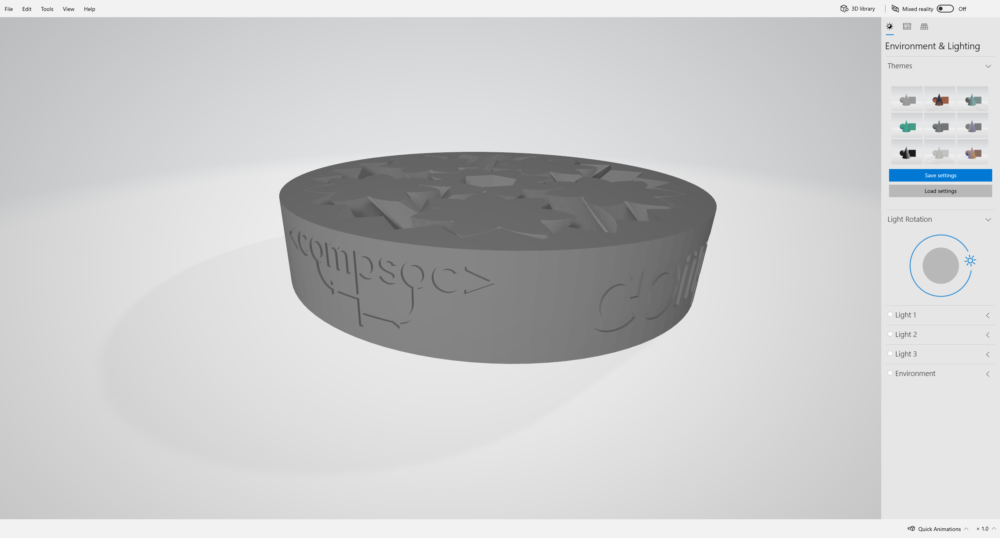

# RHUL CompSoc Gear Bearing
A gear bearing with some CompSoc flair to be given out as goodies at the Freshers Fair 2021.

## Modifying
Use OpenSCAD to open the file - Try using the Visual Studio Code extension too!

## Licencing
This project is a modification of [_Gear Bearing_ by emmett](https://www.thingiverse.com/thing:53451), licenced under the [https://creativecommons.org/licenses/by-sa/3.0/](https://creativecommons.org/licenses/by-sa/3.0/) licence.

This project has some code _pinched_ from here: https://openhome.cc/eGossip/OpenSCAD/TextCylinder.html

This project retains the same licence.
